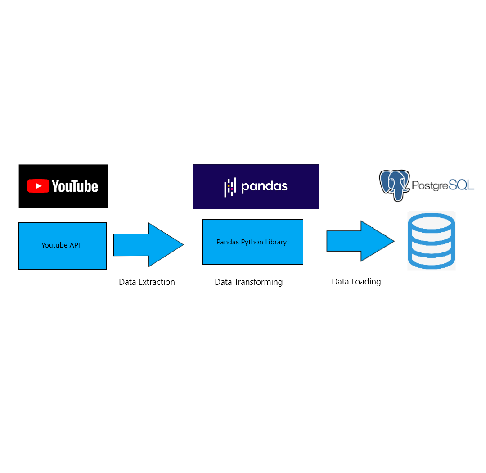

# Youtube-Trending-Videos-Pipeline

## Goal Of This Project

  This is a data pipeline for extracting youtube videos from several regions that are trending.The goal of this pipeline is to contribute to the public dataset site Kaggle and to analyze the differences of videos spread around different regions.

## Pipeline Description

  The pipeline is quite simple, it uses the Youtube API to extract the data then it structures the data and then it loads the data into a database using Pandas.
  
## Architecture

